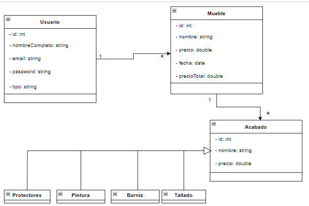

### Editor de Personajes
---
Proyecto realizado en Angular y Node.
version de Angular_cli 12.0.4
version de node 14.17.1

antes de ejecurtar los proyectos
no se olvide de ejecutar la Base Datos con el nombre muebleria y cambiar sus credenciales  "API/mySql/mySql.js"

	connection = mysql.createConnection({
                host: 'localhost',
                user: 'root',
                password: '',
                database: 'muebleria'
            });

ejecute tambien el comando  para hacer las debidas importaciones tanto en la API y Frontend
`npm install`

una ves ejecutado  el comando,  para correr el proyecto de angular debe encontrarse en dicho directorio y ejecutar.

`ng serve`

De la misma manera para ejecutar el proyecto de node.

`npm start`

---
 ### Diagrama UML del proyecto

###End
